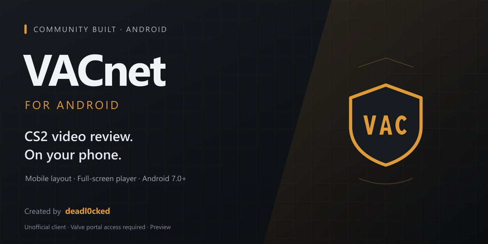

  

  <strong>Портал VACnet — в удобном формате для Android.</strong> 
  An unofficial Android client for Valve’s CS2 video review portal.

  
  
  

<a href="#видеообзор--app-walkthrough">Видео / Demo</a> · <a href="#русский">Русский</a> · <a href="#english">English</a> · <a href="PRESS_KIT.md">Для прессы / Press kit</a> · <a href="https://github.com/deadl0cked/vacnet-android/issues">Обратная связь / Feedback</a>

## Видеообзор / App walkthrough

  <video src="https://github.com/user-attachments/assets/ef7817c7-083c-4b40-b376-eb4eec8fc8ec" controls></video>

  <strong>40 секунд: запуск приложения, просмотр клипа и работа с ответами.</strong> 
  A 40-second screen recording: app launch, clip review and labeling.  
  <a href="https://github.com/deadl0cked/vacnet-android/releases/download/v1.0-preview/VACnet-Android-walkthrough.mp4">↓ Скачать видео / Download MP4</a>

> **Неофициальное приложение.** Не связано с Valve и не выдаёт приглашения в VACnet. Доступ к порталу определяется Valve. Версия 1.0 preview — подписанная **debug-сборка** для раннего знакомства, с включённой отладкой WebView.

## Русский

VACnet открывает [официальный портал просмотра клипов CS2](https://www.counter-strike.net/vacnet/) в отдельном Android-приложении. Главное дополнение — адаптация страницы под небольшой экран: мобильная раскладка, более удобные элементы управления и полноэкранное видео.

### Что умеет

- **Мобильная раскладка:** страница адаптируется под экран телефона; адаптацию можно отключить в панели настроек.
- **Полноэкранное видео:** просмотр в горизонтальной ориентации с возвратом к странице кнопкой «Назад».
- **Удобная оболочка:** тёмная тема, индикатор загрузки и обновление страницы жестом там, где оно не мешает просмотру.
- **Продолжение работы:** сохранение cookies и позиции прокрутки между запусками.
- **Восстановление соединения:** экран ошибки и повторная загрузка после возвращения сети.
- **Внешние ссылки:** открываются через браузер или соответствующее приложение.

### Скачать и установить

**[↓ Скачать VACnet 1.0 preview для Android](https://github.com/deadl0cked/vacnet-android/releases/download/v1.0-preview/VACnet-1.0-preview.apk)** — 5,51 MiB, Android 7.0 и выше.

1. Скачайте файл **`VACnet-1.0-preview.apk`** по ссылке выше или из раздела [Releases](https://github.com/deadl0cked/vacnet-android/releases).
2. Откройте APK на телефоне. Если Android запросит разрешение на установку из этого источника, разрешите его для приложения, которым вы открываете файл. После установки его можно отключить.
3. Запустите VACnet. Для функций портала нужны интернет и доступ, предоставленный Valve вашему Steam-аккаунту.

Архивы **Source code (zip / tar.gz)** в Releases содержат материалы этой страницы. Для установки нужен **APK**.

### Перед использованием

- Приложение — WebView-клиент; оно зависит от сайта Valve и установленного Android System WebView. Изменения сайта могут нарушить мобильную раскладку.
- APK не предоставляет доступ к закрытым функциям портала, не запускает CS2 и не является самостоятельным античитом.
- Этот предварительный выпуск собран в режиме debug. Он не прошёл независимый аудит; проверка входа и работы с клипами на реальном устройстве в рамках публикации не проводилась.
- Будущая сборка с другим ключом подписи может потребовать удаления этой версии и повторного входа. Удаление приложения удаляет его локальные данные.

### Автор и обратная связь

Сделано **[deadl0cked](https://github.com/deadl0cked)**. Связаться с автором: **[Telegram](https://t.me/deadl0cked)**.

Нашли проблему? [Создайте issue](https://github.com/deadl0cked/vacnet-android/issues/new/choose), указав модель телефона, версию Android и шаги воспроизведения. Не публикуйте пароли, cookies, коды входа или данные чужих аккаунтов.

Если приложение оказалось полезным, звезда репозиторию и ссылка друзьям помогут другим найти его. Для обзоров и новостей есть [пресс-кит](PRESS_KIT.md) с фактами и указанием автора.

## English

**VACnet brings Valve’s CS2 video review portal to an Android app with a phone-friendly layout.** It adds a mobile page layout, a landscape full-screen player, a dark app shell, saved sessions and scroll position, and recovery after connection errors.

**[↓ Download VACnet 1.0 preview APK](https://github.com/deadl0cked/vacnet-android/releases/download/v1.0-preview/VACnet-1.0-preview.apk)** — 5.51 MiB · Android 7.0+ · internet required.

Open the APK on your phone and follow Android’s installation prompt. Download the **APK**, not GitHub’s automatically generated “Source code” archives. Portal access is granted by Valve; this app does not issue invitations or unlock restricted features.

This is an **unofficial preview**, unaffiliated with Valve. The downloadable APK is a signed **debug build with WebView debugging enabled**. It depends on the live website and Android System WebView. Device testing of sign-in and clip review was not performed as part of publication. A future APK signed with a different key may require uninstalling this version, removing its local data and signing in again.

Created by **[deadl0cked](https://github.com/deadl0cked)** · [Contact](https://t.me/deadl0cked) · [Report a problem](https://github.com/deadl0cked/vacnet-android/issues/new/choose) · [Press kit](PRESS_KIT.md).

## Privacy / Конфиденциальность

The app loads the Valve portal and Steam sign-in pages, which receive the data you submit and normal web requests. Cookies and WebView storage persist locally on your device. The reviewed app code contains no separate developer analytics or developer account backend. Website data handling is governed by the website operators. See [PRIVACY.md](PRIVACY.md) for details.

## Source and rights / Исходники и права

This repository contains public documentation and promotional assets. **The Android application source code is not published.** The APK is provided for personal use. No open-source license for the application is granted. Third-party components and trademarks retain their respective rights; see [COPYRIGHT.md](COPYRIGHT.md) and [THIRD_PARTY_NOTICES.md](THIRD_PARTY_NOTICES.md).

Counter-Strike, Steam, Valve and VACnet names belong to their respective rights holders. This community project is not endorsed by Valve.
